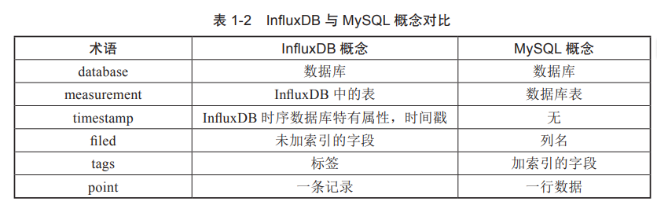

# InfluxDB
## 一、印象
1、同一个measurement（表）中同同tag（索引）同retention policy(保存策略)的数据会自动加时间戳，这类数据属于一个series（数据序列）。时序数据库是以series为单位来存储的（关系是以record（行）。下图我理解有3个series。

* **retention policy**定义了数据在数据库中保留的时间，以及如何存储数据（比如数据的存储周期、副本数量等）。它决定了数据多久后被清理或下采样（downsampled），这对于管理数据库的大小和性能非常重要。

2、对更新和删除不友好。
3、influxDB同mysql的概念对比

4、采用LSM Tree的变种，比关系型数据库（B+树数据结构）写入速度要高很多。
5、冷数据放入磁盘，热数据放入内存，查询效率高。