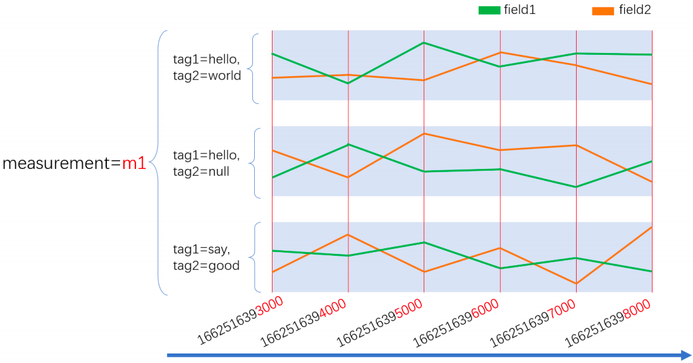
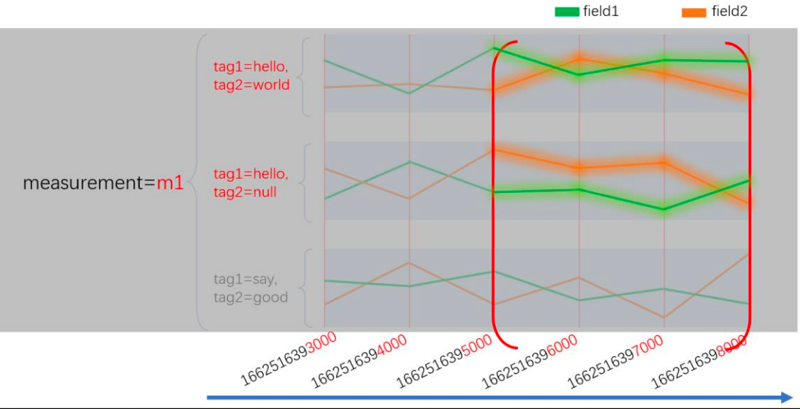
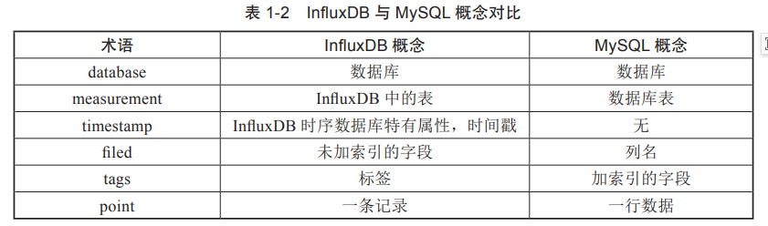

# InfluxDB
## 一、印象
1、唯一 的 measurement，tag_set 和 fileld（**一个字段**）组合是一个 series（序列）。时序数据库是以series为单位来存储的（关系是以record（行）。

* **retention policy**定义了数据在数据库中保留的时间，以及如何存储数据（比如数据的存储周期、副本数量等）。它决定了数据多久后被清理或下采样（downsampled），这对于管理数据库的大小和性能非常重要。
2、双索引设计与高效查询思路
我们之前说到你可以将 measurement、tag_set 和 field 视为索引，还没有提到最重要的时间。其实，在 InfluxDB 中时间也是索引，数据在入库时，会按时间戳进行排序。这样， 我们在进行查询时，一般遵循下面的思路。
    先指定要从哪个存储桶查询数据
    指定数据的时间范围
    指定 measurement、tag_set、和 field 说明我要查询哪个序列。
假如，我现在只指定要查询 measurent 为 m1 和 tag1 为 hello 的数据，那么就会命中图中 4 条序列。所以实际上，measurement，tag，field 都是倒排索引。

3、对更新和删除不友好。
4、influxDB同mysql的概念对比

5、采用LSM Tree的变种，比关系型数据库（B+树数据结构）写入速度要高很多。
6、冷数据放入磁盘，热数据放入内存，查询效率高。
7、安装参考：https://blog.csdn.net/qq_36437991/article/details/139497850
8、能操作influxdb的客户端是influx CLI（目前没有发现更好用的）。官方网址是：https://docs.influxdata.com/influxdb/v2/tools/influx-cli/?t=Windows
按照文档说明下载、解压就可以。
* 在安装目录下打开powershell
* 执行
.\influx config create --config-name influxformuhe --host-url http://localhost:8086 --org muhe --token cU7aieVSAqWv5WD2yaaxSKwX76RZatN83WD7t1Qh1-KTwX5SZnrkJRYPyW7NkvcQvnoUQE3dKNOPh0aU32VIfg== --active
配置数据源地址和token连接，注意修改变量值config-name、host-url、org、token（为API TOKEN）
* 执行
.\influx config create -n connectformuhe -u http://localhost:8086 -p admin:admin666 -o muhe
配置数据源用户名和密码，注意修改变量值
* 执行 .\influx v1 shell  打开数据库操作客户端
* 剩下的就是使用InfluxQL语法操作数据库了